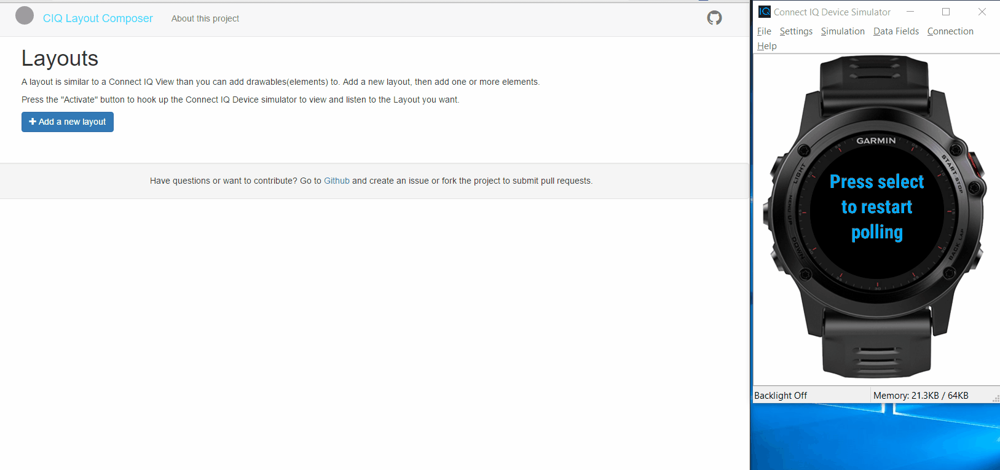

# CIQ Layout Composer

## About

This is a specific tool I've created to assist Garmin Connect IQ developers when creating user interfaces (views). This tool enables developers to create a user interface in an editor while previewing the end result in the simulator app. When finished the app can generate Connect IQ View code that can be copied into a view.

###Features
* Create drawable elements in the editor
* Show the end-result in the simulator while editing
* Generate code to include in your own app

While this tool is fully usable now, the intention is to be able to deploy this to a web server, making it far more accessible to all Connect IC developers.

I've used this as a way to learn React, Redux and Node development. I would appreciate feedback on ways to improve this codebase.

### Show and Tell
####*Feature Animation*


### Based on:
* [Garmin Connect IQ](http://developer.garmin.com/connect-iq/overview/)
* [Swagger API](http://swagger.io/)
* [MongoDB](https://www.mongodb.org/)
* [ react-redux-universal-hot-example](https://github.com/erikras/react-redux-universal-hot-example)
* [Universal](https://medium.com/@mjackson/universal-javascript-4761051b7ae9) rendering
* Both client and server make calls to load data from separate API server
* [React](https://github.com/facebook/react)
* [React Router](https://github.com/rackt/react-router)
* [Express](http://expressjs.com)
* [Babel](http://babeljs.io) for ES6 and ES7 magic
* [Webpack](http://webpack.github.io) for bundling
* [Redux](https://github.com/rackt/redux)'s futuristic [Flux](https://facebook.github.io/react/blog/2014/05/06/flux.html) implementation
* [ESLint](http://eslint.org) to maintain a consistent code style
* [redux-form](https://github.com/erikras/redux-form) to manage form state in Redux
* [mocha](https://mochajs.org/) to allow writing unit tests for the project.

## Requirements
* Node / npm
* MongoDB

## Installation
```bash
npm install
```

## Running Dev Server
```bash
(Make sure MongoDB is installed and running)
(run this is a separate terminal)

>npm run dev
open your browser to http://localhost:3040
```

## Running the Connect IQ Simulator App
With Eclipse and the Connect IQ SDK:
```bash
Open and run the CIQLayoutViewer project
Make sure to "activate" the current layout in the editor
```

## Running production Server
NB - This is not needed for testing/development
```bash
(Make sure MongoDB is installed and running)
(run this is a separate terminal)

>npm run build
>npm run start
open your browser to http://localhost:8080
```


## Documentation

* [VIEWER.md](docs/VIEWER.md) for details about the simulator Viewer app
* [API.md](docs/API.md) for details about the API
* [Development info](docs/DEVELPMENT.md) contains details about Development.

## FAQ

This Faq will contain more information at a later stage
Check issues or create an issue for any unresolved issues.

## Roadmap

There are many things that I had to omit in the first release:

* Publish to a web server as an open source community tool
* Enable user login and use the Connect IQ Viewer as an app on their watch
* Ability to set order of elements (z-order)
* Duplicate elements
* Watch constraints and images
* Visual editor to set/draw coordinates
* Polygon and Bitmap elements
* Input validation

## Contributing

I am more than happy to accept external contributions to the project in the form of feedback, bug reports and pull requests.

If you would like to submit a pull request, please make an effort to follow the guide in [CONTRIBUTING.md](CONTRIBUTING.md).

---
Thanks for checking this out.

– Håkon Rossebø, [@hakonrossebo](https://twitter.com/hakonrossebo)
